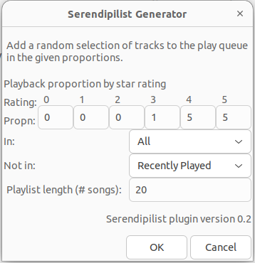

Serendipilist - Rhythmbox plugin
==================

Play a random selection of tracks in the given proportions.



## Requirements

Rhythmbox > 3.0

## Installation

```
git clone https://github.com/miciasto/serendipilist
cd serendipilist
./install.sh --rb3
```

### Use

Enable the plugin in Rhythmbox:

- Preferences -> Plugins -> Serendipilist

Use the plugin to create a playlist:

- Tools -> Serendipilist Playlist

## Author

miciasto

https://github.com/miciasto/serendipilist
